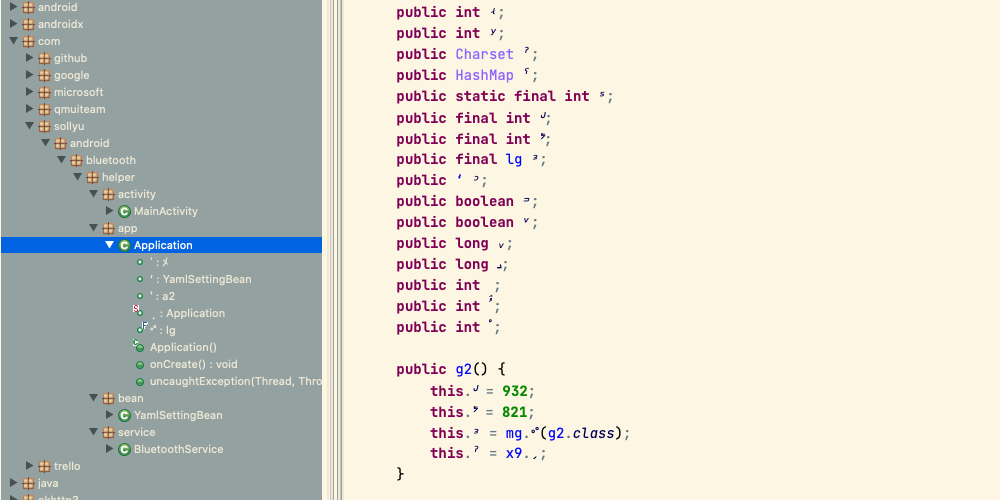
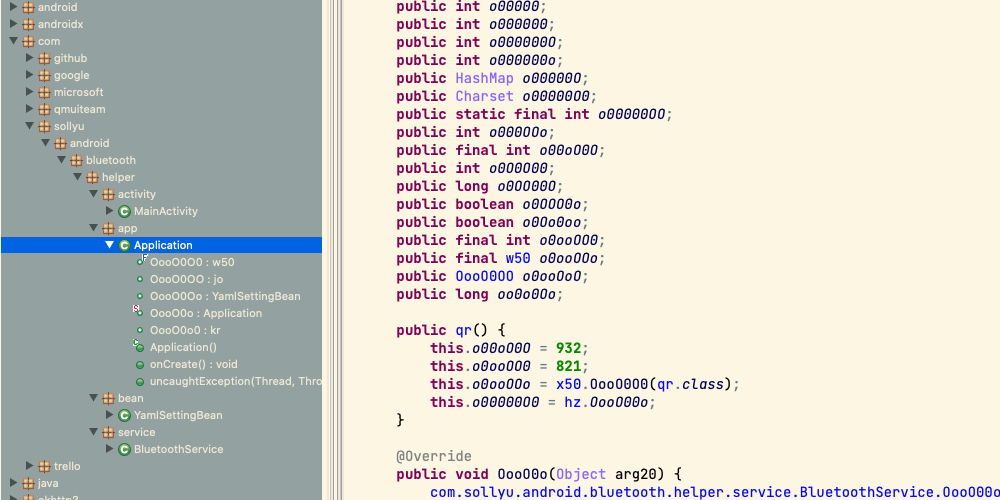
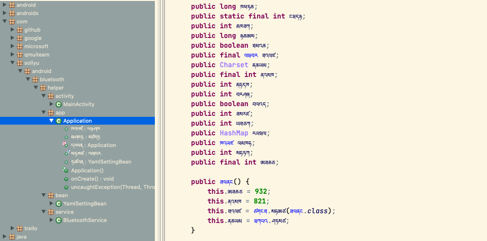
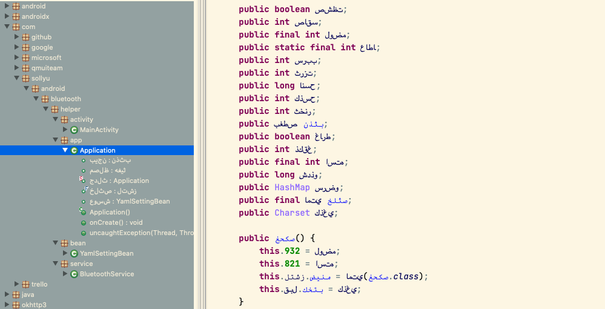
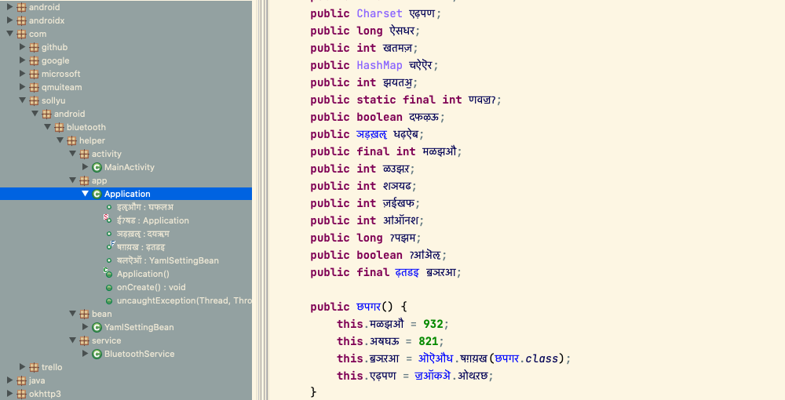
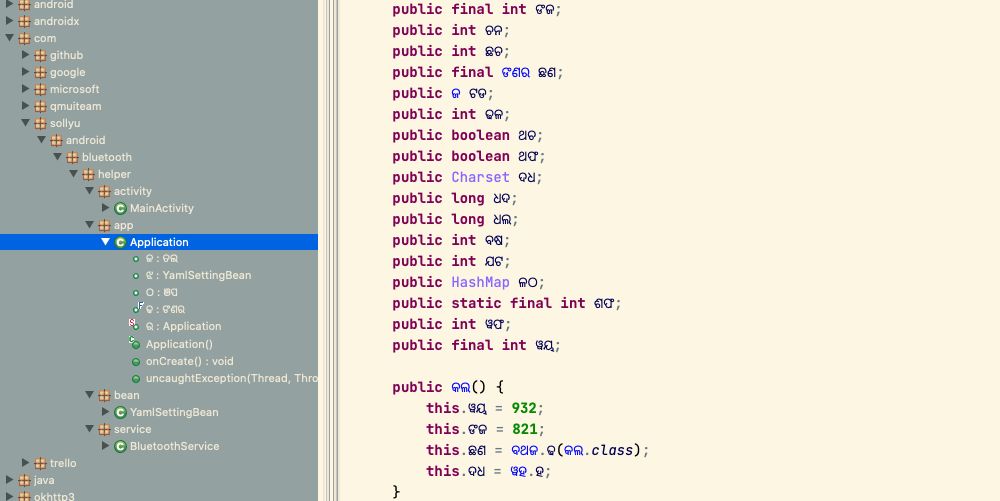
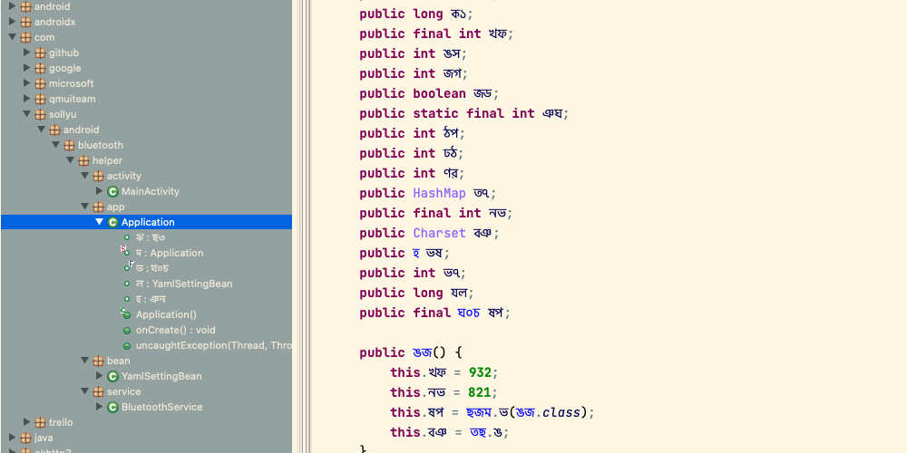
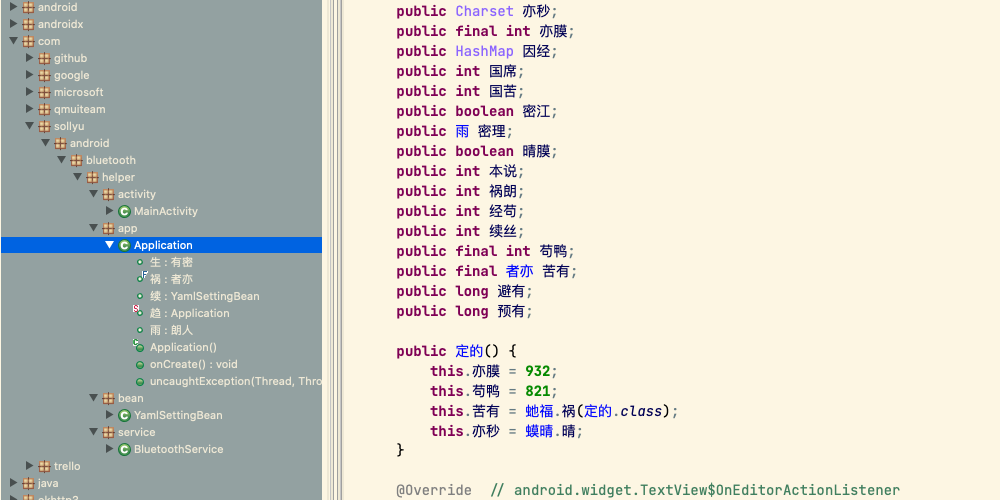
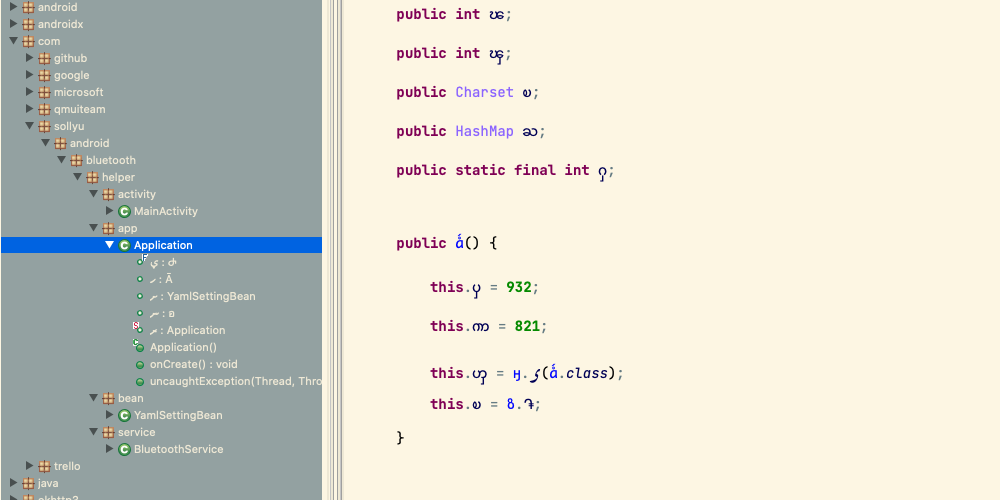

## 说明
混淆控制字典

## 使用

```
-obfuscationdictionary          proguard-dic-1.txt
-renamesourcefileattribute      proguard-dic-1.txt
-classobfuscationdictionary     proguard-dic-1.txt
-packageobfuscationdictionary   proguard-dic-1.txt
```

## 文件

|文件|说明|
|---|---|
|proguard-log.pro|删除Log记录|
|[proguard-dic-1.txt](#proguard-dic-1txt)|网有文件1|
|[proguard-dic-2.txt](#proguard-dic-2txt)|网有文件2|
|[proguard-dic-3.txt](#proguard-dic-3txt)|藏语字母表|
|[proguard-dic-4.txt](#proguard-dic-4txt)|阿拉伯字母表|
|[proguard-dic-5.txt](#proguard-dic-5txt)|天城文字母表|
|[proguard-dic-6.txt](#proguard-dic-6txt)|奥里亚文母表|
|[proguard-dic-7.txt](#proguard-dic-7txt)|孟加拉文母表|
|[proguard-dic-8.txt](#proguard-dic-8txt)|长者语录母表|
|[proguard-dic-9.txt](#proguard-dic-9txt)|[网友作者搬运](https://github.com/hqzxzwb/ProguardDictionaryGenerator)|

## 预览

### proguard-dic-1.txt



### proguard-dic-2.txt



### proguard-dic-3.txt



### proguard-dic-4.txt



### proguard-dic-5.txt



### proguard-dic-6.txt



### proguard-dic-7.txt



### proguard-dic-8.txt



### proguard-dic-9.txt



## Licenses

```
Copyright 2019-2020 sollyu.com

Licensed under the Apache License, Version 2.0 (the "License");
you may not use this file except in compliance with the License.
You may obtain a copy of the License at

   http://www.apache.org/licenses/LICENSE-2.0

Unless required by applicable law or agreed to in writing, software
distributed under the License is distributed on an "AS IS" BASIS,
WITHOUT WARRANTIES OR CONDITIONS OF ANY KIND, either express or implied.
See the License for the specific language governing permissions and
limitations under the License.
```
